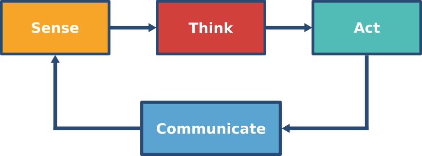
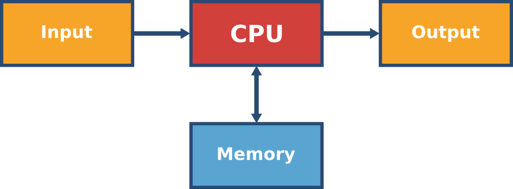
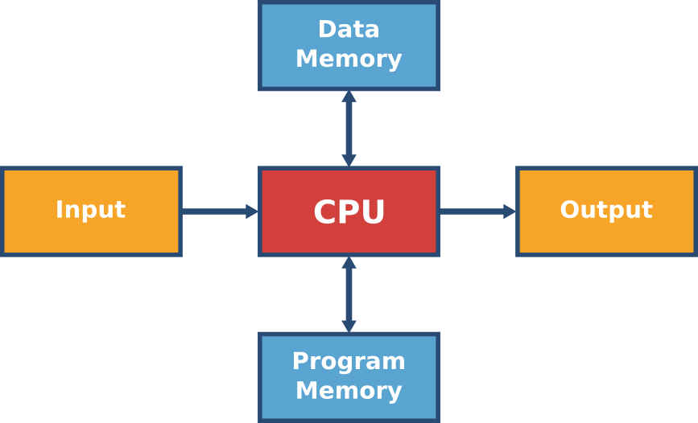
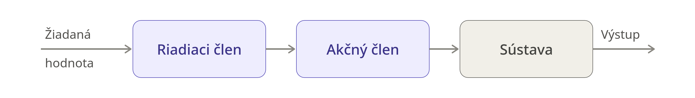
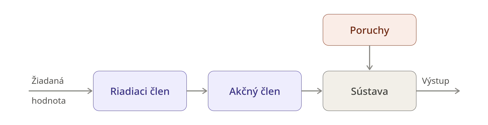
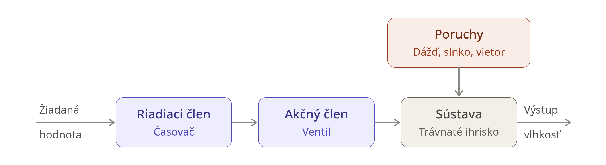
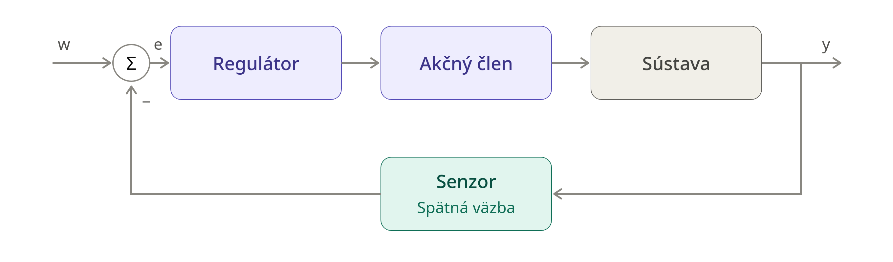
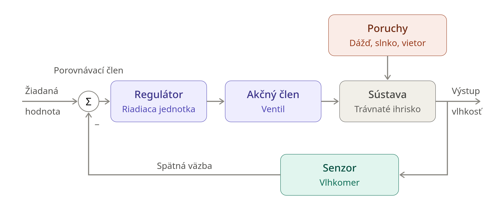
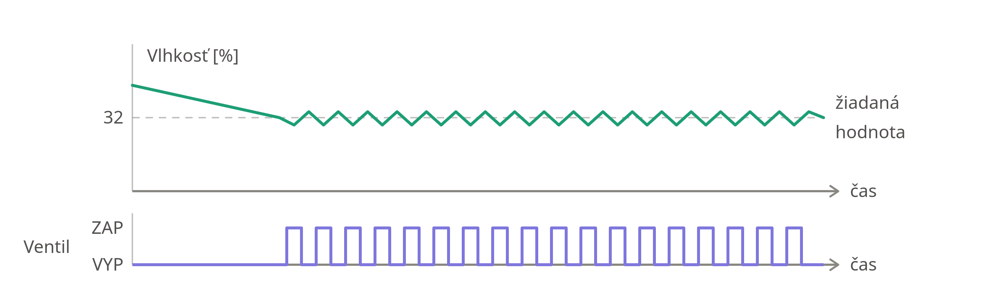
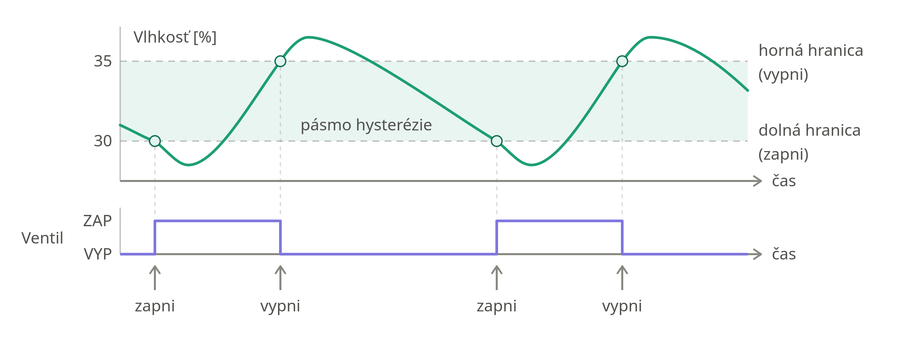

# Prednáška 2: Veci

> **IoT | Veci, riadiace jednotky, senzory, akčné členy a riadiace systémy**  
> Zdroj: [prednáška IoT 02](https://kurzy.kpi.fei.tuke.sk/iot1/lectures/02/)

## 1. Čo je vec v IoT?

Predchádzajúca prednáška predstavila IoT a jeho architektúry. Architektúra
projektu používaná v tomto kurze je trojvrstvová architektúra s názvom
**Smart Department**.

Systém IoT je systém vzájomne prepojených výpočtových zariadení, mechanických a
digitálnych strojov, predmetov, zvierat alebo ľudí, ktoré majú jedinečné
identifikátory a dokážu prenášať údaje cez sieť bez potreby interakcie medzi
ľuďmi alebo medzi človekom a počítačom.

V tejto prednáške **vec** znamená fyzický predmet alebo zariadenie. Môže ísť o
výpočtové, mechanické alebo digitálne zariadenie, musí však obsahovať
komponenty potrebné na interakciu s okolím a komunikáciu.

Vec v IoT vo všeobecnosti:

- má fyzickú reprezentáciu;
- má jedinečnú identitu;
- má programovateľnú riadiacu jednotku;
- obsahuje senzory a akčné členy;
- dokáže komunikovať s inými vecami alebo vyššími vrstvami, napríklad bránou,
  edge systémom alebo cloudom.

## 2. Cyklus Snímaj – Mysli – Pripoj sa – Konaj

Zariadenia IoT sa často opisujú pomocou obmien robotického paradigmu:

- **Snímaj (Sense)** – pomocou senzorov zbieraj informácie z prostredia.
- **Mysli (Think)** alebo **Usudzuj (Infer)** – spracuj informácie a rozhodni,
  čo znamenajú.
- **Pripoj sa (Connect)** – vymieňaj si údaje s inými zariadeniami alebo
  vyššími vrstvami.
- **Konaj (Act)** – pôsob na prostredie pomocou akčných členov.

Niektoré opisy vynechávajú `Connect` alebo používajú cyklus
`Sense–Infer–Act`, komunikácia je však v IoT mimoriadne dôležitá, pretože
odlišuje pripojené veci od bežných samostatných zariadení.

## 3. Mikrokontroléry a mikroprocesory

Riadiaca jednotka je programovateľný „mozog“ veci v IoT. Bežne sa realizuje
pomocou **mikrokontroléra**.

**Mikrokontrolér** je integrovaný obvod, ktorý obsahuje procesor, pamäť a
periférie na jednom čipe. Je lacný, kompaktný, energeticky úsporný a určený na
špecifickú alebo obmedzenú množinu úloh v zariadeniach, ako sú spotrebiče,
vozidlá, senzory a riadiace jednotky.

### Mikroprocesor verzus mikrokontrolér

| Mikroprocesor | Mikrokontrolér |
| --- | --- |
| Všeobecné zariadenie na spracovanie údajov. | Špecializované zariadenie, často označované ako počítač v jedinom čipe. |
| Zvyčajne poskytuje CPU počítača. | Používa sa v jednoduchých zariadeniach alebo zariadeniach s jediným účelom. |
| Vyžaduje externú pamäť, I/O, časovače a ďalšie periférie. | Na čipe obsahuje RAM, ROM/flash, rozhrania, časovače a periférie. |
| Zložitejší návrh. | Jednoduchší návrh. |
| Drahší, často stojí desiatky alebo stovky eur. | Lacný, často stojí iba niekoľko eur. |
| Vyššia spotreba energie, v počítači zvyčajne desiatky wattov. | Nízka spotreba energie, zvyčajne niekoľko wattov alebo menej. |
| Zvyčajne sa spája s von Neumannovou architektúrou. | Často sa spája s harvardskou architektúrou. |
| Vysoké taktovacie frekvencie, zvyčajne v GHz. | Nižšie taktovacie frekvencie, zvyčajne v MHz. |
| Príklad: procesor v Raspberry Pi. | Príklady: ATmega328P, ESP32, micro:bit a RP2040. |

### Von Neumannova architektúra

**Von Neumannova architektúra**, ktorú v roku 1945 navrhol John von Neumann, sa
používa v bežných počítačoch. Jej hlavné bloky sú:
- **CPU (Central Processing Unit – centrálna procesorová jednotka)**:
  - aritmeticko-logická jednotka vykonáva aritmetické a logické operácie;
  - riadiaca jednotka koordinuje činnosť počítača.
- **Pamäť** uchováva program aj jeho údaje.
- **Vstup** prijíma informácie.
- **Výstup** vytvára výsledky.

Program a údaje zdieľajú rovnakú pamäť a komunikačnú cestu. Spracovanie je
preto prevažne sekvenčné.

### Harvardská architektúra

**Harvardská architektúra** fyzicky oddeľuje pamäť programu od dátovej pamäte a
na ich prístup používa samostatné zbernice. To umožňuje spracovávať inštrukcie
a údaje paralelne.

Dôležité vlastnosti:

- programové inštrukcie a údaje zaberajú odlišné pamäťové priestory;
- obe zbernice môžu mať odlišnú šírku;
- k inštrukciám a údajom možno pristupovať súčasne;
- adresové priestory sú oddelené;
- program nemôže tak ľahko prepísať vlastné inštrukcie ako pri návrhu so
  zdieľanou pamäťou.

## 4. Populárne vývojové platformy

Tieto platformy sú užitočné na prototypovanie vecí IoT:

- **Raspberry Pi** – malý univerzálny počítač s Wi-Fi, Bluetooth, BLE a
  Ethernetom. Potrebuje nepretržité napájanie, bežne neposkytuje spánkové
  režimy typické pre mikrokontroléry, a preto nie je najlepšou voľbou pre
  zariadenia s nízkou spotrebou riadené prerušeniami.
- **Arduino Uno** – obľúbená prototypovacia doska dostupná od roku 2005. Má
  32 kB flash pamäte pre program a 2 kB SRAM pre premenné.
- **BBC micro:bit** – lacná vzdelávacia doska s mnohými integrovanými
  komponentmi a Bluetooth Low Energy. Verzia 1 podporuje Bluetooth 4.1 a
  verzia 2 podporuje Bluetooth 5.0.
- **Dosky ESP32** – dosky s mikrokontrolérom, Wi-Fi a Bluetooth Low Energy.
  Rôzne verzie majú odlišné rozloženie a bežne poskytujú 30 alebo 38 pinov.
- **Raspberry Pi Pico WH** – mikrokontrolérová doska Raspberry Pi založená na
  RP2040. Kurz používa rodinu Pico a MicroPython na tvorbu vecí.

### Porovnanie dosiek

| Vlastnosť | Arduino Uno | ESP32 | BBC micro:bit | Raspberry Pi Pico WH |
| --- | --- | --- | --- | --- |
| Mikrokontrolér | ATmega328P | ESP32 | nRF52833 | RP2040 |
| Procesor | - | Tensilica Xtensa LX6 | ARM Cortex-M0 | ARM Cortex-M0+ |
| Architektúra | 8-bitová | 32-bitová | 32-bitová | 32-bitová |
| Jadrá | 1 | 2 | 1 | 2 |
| Frekvencia | 16 MHz | 240 MHz | 16 MHz | 133 MHz |
| SRAM | 2 kB | 520 kB | 16 kB | 264 kB |
| Flash | 32 kB | 16 MB | 256 kB | 2 MB |
| Prevádzkové napätie | 5 V | 3,3 V | 3,3 V | 3,3 V |
| Komunikácia | - | Wi-Fi, BLE | BLE | Wi-Fi, BLE 5.2 |
| Typický prúd | 60 mA | 55 mA | 17 mA | 18 mA |

## 5. Senzory, akčné členy a komunikácia

### Senzory

**Senzor** prevádza fyzikálnu veličinu na elektrický signál a následne na
číselnú hodnotu, ktorú môže zariadenie spracovať. Príklady senzorov:

- intenzita osvetlenia;
- teplota;
- vlhkosť;
- vzdialenosť;
- pohyb;
- úroveň naplnenia.

### Akčné členy

**Akčný člen** prevádza elektrickú energiu na fyzický účinok. Príklady:

- LED;
- motor;
- ventil;
- vykurovacie teleso;
- alarm alebo displej.

### Komunikácia

Komunikácia robí z veci IoT vec, nie izolované zariadenie. Vec môže
komunikovať s inými vecami alebo vyššími vrstvami, napríklad s IoT bránou,
edge systémom alebo cloudom.

Komunikačnú technológiu a protokol treba vybrať podľa prostredia, dosahu,
obmedzení spotreby, množstva údajov a požadovanej spoľahlivosti. Kurz sa
konkrétnym protokolom venuje v neskorších prednáškach.

## 6. Návrh veci IoT pre inteligentný odpadkový kôš

Projekt kurzu je služba inteligentného zberu odpadu. Každý kontajner môže
obsahovať vec, ktorá monitoruje jeho stav a rozhoduje, kedy je potrebná akcia.
Návrh by mal spĺňať všeobecné vlastnosti veci IoT: fyzickú reprezentáciu,
jedinečnú identitu, riadiacu jednotku, senzory, akčné členy a komunikáciu.

Možné komponenty:

- **Senzor úrovne odpadu** – ultrazvukový senzor môže zistiť, že kontajner je
  takmer plný, a zabrániť pretečeniu.
- **Senzor teploty a vlhkosti** – monitoruje podmienky, ktoré môžu spôsobiť
  hnitie organického odpadu, zápach alebo zvýšiť riziko požiaru.
- **Senzor plameňa** – môže odhaliť požiar spôsobený cigaretou alebo úmyselným
  zapálením a vyvolať včasné varovanie.
- **Senzor otvorenia** – zaznamenáva používanie a môže spustiť akcie, napríklad
  zmerať úroveň naplnenia po zatvorení veka.
- **Komunikačný modul** – odosiela merania do databázy na spracovanie. Jeho
  výber závisí od prostredia kontajnera.
- **Senzor vlhkosti pôdy** – užitočný pre kompostovací kontajner na sledovanie
  procesu kompostovania.
- **Lokalizačný systém** – GPS, QR kódy, NFC alebo iná metóda môžu byť
  užitočné podľa toho, či sú kontajnery statické alebo sa často presúvajú.
- **Stavové akčné členy** – LED, displej alebo zvuk môžu signalizovať, že
  zariadenie meria alebo prenáša údaje. Tieto komponenty zvyšujú spotrebu
  energie.
- **Zdroj energie** – môže byť potrebná batéria alebo alternatívny zdroj,
  napríklad solárne články, pretože kontajner nemusí mať trvalé napájanie.

## 7. Ďalšie hľadiská návrhu

### Veľkosť

Zariadenia IoT sú často malé a môžu patriť do kategórie **nositeľnej
elektroniky**. Prototyp môže byť veľký, no veľkosť konečného produktu treba
zohľadniť už od začiatku.

### KISS

**KISS** znamená „Keep it simple, stupid“ alebo „Keep it stupid simple“
(„Udržuj to jednoduché“). Systémy zvyčajne fungujú lepšie, keď sú jednoduché.
Platí to pre hardvér, fyzický návrh aj softvér.

Zbytočná zložitosť zvyšuje náklady, spotrebu energie, náročnosť údržby a počet
možných miest zlyhania. Jednoduchosť neznamená nedostatok pokročilosti; je to
zámerný cieľ návrhu.

### Veci ako stavové automaty

Správanie väčšiny zariadení možno opísať pomocou **stavového diagramu**. Takéto
zariadenia sú preto **konečné automaty** alebo **stavové automaty**.

Stavový automat pomáha pri vývoji tým, že delí zložitý problém na menšie stavy
a prechody. Jeho základný zápis obsahuje iba:

- **stavy** – režimy, v ktorých môže zariadenie pracovať;
- **prechody** – udalosti alebo podmienky, ktoré presúvajú zariadenie medzi
  stavmi.

Stavy a prechody možno rozšíriť o akcie pri vstupe, akcie pri výstupe,
podmienky a ďalšie informácie. Na implementáciu tohto modelu možno použiť
softvérový návrhový vzor State.

## 8. Systémy riadenia s otvorenou a uzavretou slučkou

Riadiace systémy možno vysvetliť na príklade automatického zavlažovacieho
systému.

### Riadenie s otvorenou slučkou

**Systém s otvorenou slučkou** premení požadovanú hodnotu na príkaz bez merania
skutočného výsledku.

Jeho hlavné bloky sú:

- **požadovaná hodnota** – cieľ, napríklad 35 % vlhkosti pôdy;
- **riadiaca jednotka** – rozhoduje, aký príkaz odoslať bez znalosti
  skutočného výstupu, napríklad časovač, ktorý o 05:00 otvorí ventil na 15
  minút;
- **akčný člen** – premieňa príkaz na fyzickú akciu, napríklad ventil;
- **systém/proces** – časť sveta, ktorá sa riadi, napríklad futbalové ihrisko;
- **výstup** – skutočne vytvorená hodnota, napríklad výsledná vlhkosť pôdy.

Zavlažovací systém s otvorenou slučkou môže zavlažovať pevne stanovený čas
alebo použiť pevné množstvo vody, nevie však, či sa dosiahla cieľová vlhkosť.
Nedokáže reagovať ani na rušivé vplyvy, ako sú dážď, slnko alebo vietor.

V prípade zavlažovania sú riadiaca jednotka s otvorenou slučkou, ventil a
ihrisko zobrazené spolu:

Systémy s otvorenou slučkou:

- nemerajú výstup;
- nereagujú na rušivé vplyvy;
- sú jednoduché, lacné a majú menej komponentov, ktoré môžu zlyhať.

Sú vhodné, keď sú podmienky stabilné alebo je prijateľný nepresný výsledok,
napríklad pri pevnom programe práčky, hriankovači alebo jednoduchom časovači
svetla.

### Riadenie s uzavretou slučkou

**Systém s uzavretou slučkou** pridáva spätnú väzbu, aby mohol reagovať na
skutočný výstup:

1. **Senzor** meria skutočný výstup, napríklad vlhkosť pôdy.
2. **Porovnávací člen** porovnáva požadovanú hodnotu s nameranou hodnotou.
3. **Riadiaca jednotka/regulátor** používa rozdiel na rozhodnutie, čo urobiť.

Rozdiel medzi požadovanou hodnotou \(w\) a nameraným výstupom \(y\) je
**regulačná odchýlka** \(e\):

\[
e = w - y
\]

Pre zavlažovanie:

- \(e > 0\): pôda je príliš suchá, preto treba zapnúť zavlažovanie;
- \(e < 0\): pôda je vlhšia, než je požadované, preto treba zavlažovanie
  vypnúť;
- \(e = 0\): dosiahla sa požadovaná vlhkosť.

Systémy s uzavretou slučkou:

- merajú výstup a konajú podľa skutočného stavu;
- reagujú na rušivé vplyvy korekciou ich účinkov;
- sú zložitejšie a drahšie, pretože potrebujú senzory a spracovanie;
- môžu sa rozhodovať nesprávne, ak senzor zlyhá alebo poskytuje nepresné
  údaje.

Príkladmi sú termostaty, chladničky, tempomat automobilu a zavlažovanie
založené na senzoroch.

### Oneskorenie a prekmit

Účinok akcie sa často neprejaví okamžite. Nazýva sa to **oneskorenie** alebo
**mŕtvy čas**. Pri zavlažovaní potrebuje voda čas, aby sa dostala k senzoru v
koreňovej zóne.

Ak regulátor ignoruje oneskorenie, senzor po spustení zavlažovania naďalej
hlási suchú pôdu. Systém pokračuje v zavlažovaní a napokon prekročí cieľovú
hodnotu. Tento jav sa nazýva **prekmit**.

Praktickým riešením je zavlažovať v dávkach, napríklad päť minút, počkať, kým
voda vsiakne do pôdy, a potom merať znova.

### Hysterézia

Ak regulátor spína pri presne jednej cieľovej hodnote, meranie, ktoré okolo
tejto hodnoty mierne kolíše, môže spôsobovať rýchle zapínanie a vypínanie.
Opotrebúva to akčný člen a môže spôsobiť nestabilitu systému.

**Hysterézia** používa dva prahy:

- zapni zavlažovanie pod **dolným prahom**, napríklad pri 30 %;
- vypni zavlažovanie nad **horným prahom**, napríklad pri 35 %;
- medzi týmito prahmi zachovaj aktuálny stav akčného člena.

Bez hysterézie môžu malé zmeny merania okolo cieľovej hodnoty opakovane spínať
akčný člen:

S hysteréziou vytvárajú dolný a horný prah stabilný rozsah:

Rozdiel medzi prahmi zabraňuje zbytočnému spínaniu. Nameraná hodnota môže po
vypnutí zavlažovania ešte krátko rásť v dôsledku oneskorenia systému.

## Kontrolný zoznam na skúšku

- Definovať vec IoT a vymenovať jej základné vlastnosti.
- Vysvetliť cyklus Snímaj–Mysli–Pripoj sa–Konaj.
- Rozlíšiť mikroprocesor, mikrokontrolér a mikropočítač.
- Porovnať von Neumannovu a harvardskú architektúru.
- Vysvetliť, prečo sa Raspberry Pi líši od mikrokontrolérovej dosky s nízkou
  spotrebou.
- Porovnať Arduino Uno, ESP32, BBC micro:bit a Raspberry Pi Pico WH.
- Rozlíšiť senzory, akčné členy a komunikačné moduly.
- Navrhnúť komponenty veci IoT pre inteligentný odpadkový kôš.
- Vysvetliť princíp KISS a modelovať zariadenie ako konečný automat.
- Porovnať riadenie s otvorenou a uzavretou slučkou.
- Vysvetliť spätnú väzbu, regulačnú odchýlku, oneskorenie, prekmit a
  hysteréziu.

### Hlavná myšlienka

Vec IoT je fyzické, identifikovateľné, programovateľné a komunikujúce
zariadenie, ktoré sníma svoje prostredie a môže naň pôsobiť. Dobrý návrh IoT
kombinuje správnu riadiacu jednotku, senzory, akčné členy, komunikáciu, zdroj
energie a jednoduché správanie založené na stavoch. Keď musí výsledok zostať
správny napriek meniacim sa podmienkam, spätná väzba zmení proces s otvorenou
slučkou na systém riadenia s uzavretou slučkou.
